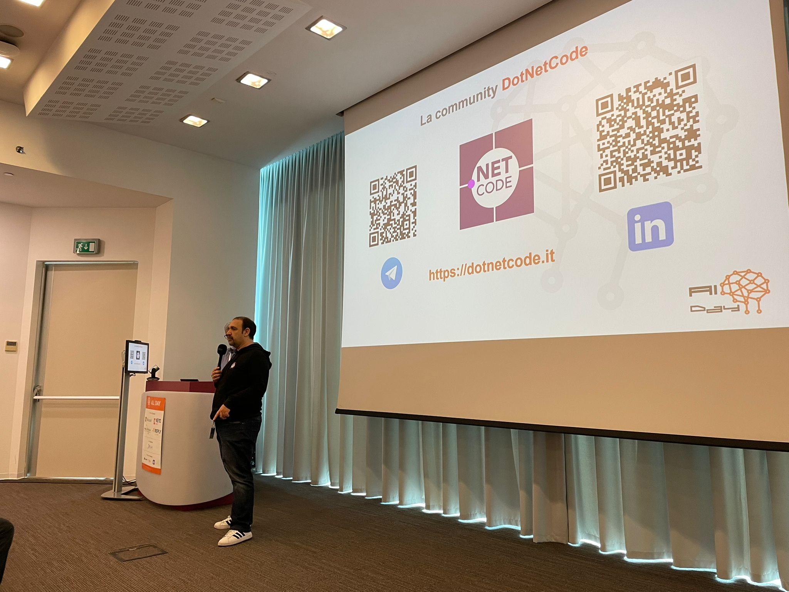
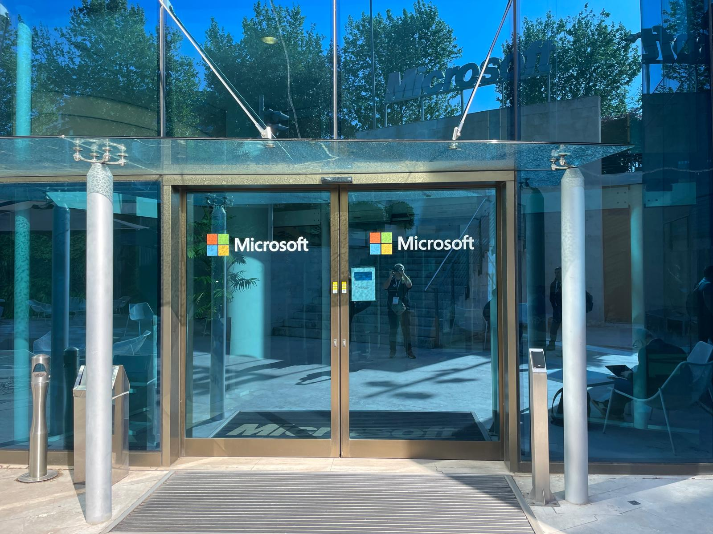
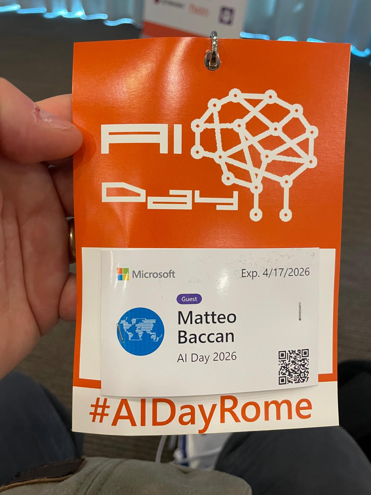
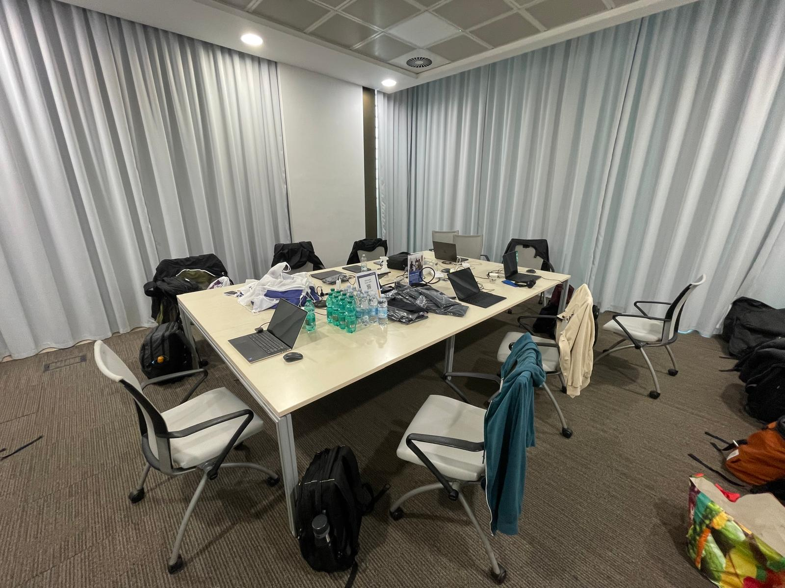
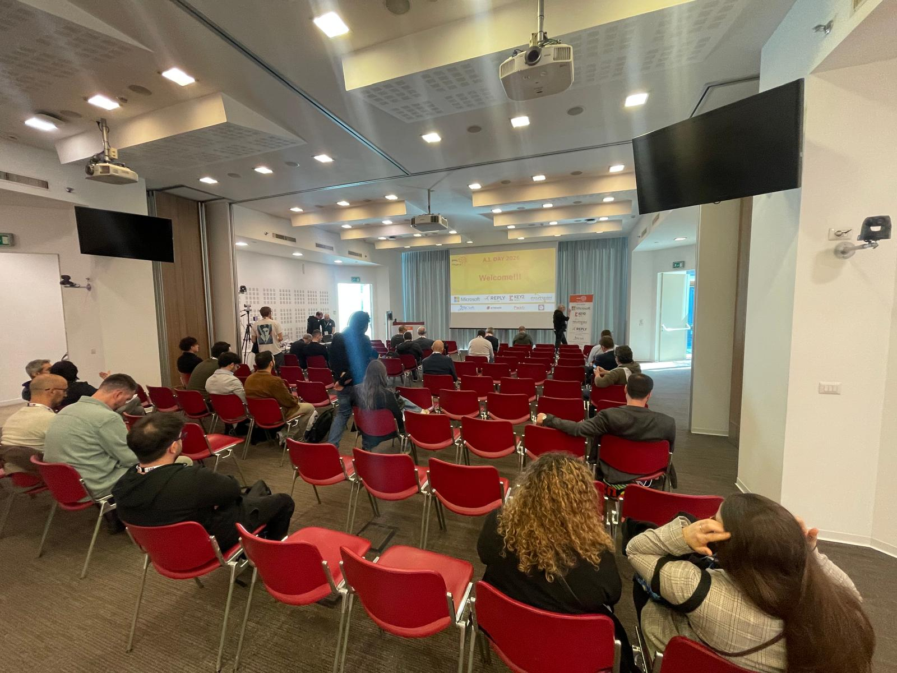

# Il Vibecoding e morto: viva lo Spec-Driven Development

In questo repository raccolgo la mia presentazione per AI Day Conference 2026.

Il messaggio centrale che porto e' questo: il Vibecoding funziona per prototipi veloci, ma non scala su sistemi reali. Per lavorare bene con l'AI propongo di passare a uno sviluppo guidato da specifiche.

## Talk in breve

- Titolo: Il Vibecoding e morto: viva lo Spec-Driven Development
- Evento: AI Day Conference 2026
- Data: 17 aprile 2026
- Location: Roma
- Durata deck in repo: 30 minuti

## Agenda dettagliata AI Day 2026

Data: venerdi 17/04/2026
Location: Roma (Rome)

### Fasce comuni

| Orario | Attivita | Room |
|:---|:---|:---|
| 09:30 | Keynote (30 min) | Room 1 |
| 10:00 | Coffee Break (30 min) | Room 1 |
| 13:00 | Lunch (60 min) | Room 1 |
| 15:40 | Coffee Break (30 min) | Room 1 |

### Sessioni parallele

| Orario | Room | Sessione | Speaker | Livello / Lingua |
|:---|:---|:---|:---|:---|
| 10:30 | Room 1 | Agent-to-Agent AI: orchestrare i Fabric Data Agent con Copilot Studio | Marco Caruso | Advanced, Italiano |
| 10:30 | Room 2 | Agentic AI senza catene: entra nel Microsoft Agent Framework | Maurizio Moriconi | Intermediate, Italiano |
| 11:20 | Room 1 | Gestione AI delle fatture: dal documento al modello predittivo | Alberto D'Angelo, Malvina Mattioni | Introductory and overview, Italiano |
| 11:20 | Room 2 | Il Vibecoding e morto: viva lo Spec-Driven Development | Matteo Baccan | Advanced, Italiano |
| 12:10 | Room 1 | AI Agents for Everyone: Creating No-Code Assistants in Microsoft 365 Copilot | Stefano Brusamolino, Beatrice Civelli | Intermediate, Italiano |
| 12:10 | Room 2 | Implementare Retrieval-Augmented Generation con Azure SQL e Microsoft Foundry | Andrea Saltarello | Intermediate, Italiano |
| 12:10 | Room Decision Makers | CxO, Decision Makers: Low Code | - | Decision Makers |
| 14:00 | Room 1 | Evoluzione di un sistema AI: da RAG a piattaforma ad agenti | Andrea Caglio, Luca Giudici | Intermediate, Italiano |
| 14:00 | Room 2 | Belli gli agenti... finche non li metti in produzione | Alessandro Mengoli | Intermediate, Italiano |
| 14:00 | Room Decision Makers | CxO, Decision Makers: No Code | - | Decision Makers |
| 14:50 | Room 1 | Hybrid AI Orchestration per Travel Booking Complessi | Andrea Belloni | Intermediate, Italiano |
| 14:50 | Room 2 | Umani & AI: la fabbrica del software del futuro | Michele Aponte, Antonio Liccardi | Intermediate, Italiano |
| 14:50 | Room Decision Makers | CxO, Decision Makers: Pro Code | - | Decision Makers |
| 16:10 | Room 1 | Potenziare gli agenti AI con ricerca semantica locale in .NET | Marco Milani | Advanced, Italiano |
| 16:10 | Room 2 | Agents Talking to Agents: Inside the A2A Protocol | Massimo Crippa | Intermediate, Italiano |
| 17:00 | Room 1 | Da GitHub Spark a .NET Aspire con un Copilot Agent: script deterministici + skills | Francesco Gallo | Intermediate, Italiano |

## Slide disponibili

- [presentation30min.md](presentation30min.md): versione talk da 30 minuti (con appendice risorse)

Genero le slide con Marp e uso gli asset presenti nella cartella [img](img).

## Foto evento

Raccolgo le foto backstage e di conferenza nella cartella [foto](foto).

### Talk con slide DotNetCode

### Ingresso Microsoft

### Badge guest Matteo Baccan

### Speaker room

### Sala conferenza e pubblico

## Struttura del contenuto

In questa presentazione seguo questo percorso:

1. Vibecoding: promessa iniziale e limiti pratici
2. Context Rot e allucinazioni credibili
3. Spec-Driven Development come approccio operativo
4. Workflow SDD in 5 step (spec, task, implementazione, review)
5. Framework e tool nel panorama attuale
6. SDD su legacy, compliance e ROI
7. Risorse per approfondire

## Idee chiave

- Sostengo che se il prompt e una richiesta, la specifica e un contratto.
- Porto l'idea che il codice sia un effetto collaterale: il vero prodotto e la specifica.
- Uso il principio run slow to run fast: il tempo speso in specifica riduce debug e rework.
- Mostro che se il codice vive oltre un mese o viene toccato da piu persone, conviene SDD.

## Workflow SDD (sintesi)

1. Inizializzo una cartella `.spec/` con contesto e convenzioni.
2. Faccio drafting dei requisiti con l'AI.
3. Congelo una specifica tecnica in Markdown.
4. Rompo la specifica in task piccoli, testabili e committabili.
5. Eseguo implementazione e review un task alla volta.

## Framework e risorse citate

- GitHub Spec Kit: https://github.com/github/spec-kit
- BMAD Method: https://github.com/bmad
- Ralph Loop / Agent.OS: https://github.com/ralphloop
- CodeSpeak: https://codespeak.dev/
- Awesome Design MD: https://github.com/VoltAgent/awesome-design-md
- Awesome Design MD Skills: https://github.com/bergside/awesome-design-md-skills

## Strumenti usati per il deck

Per costruire questo deck ho usato:

- BGE (Brigata dei Geek Estinti), puntate 98 e 99
- Gemini (riformattazione)
- Nano Banana Pro (immagini)
- Claude (prima scaletta)
- NotebookLM (riassunti)
- Antigravity (gestione progetto)
- Marp (render slide)

## Ringraziamenti

- Dario Ferrero per l'analisi di CodeSpeak: https://aitalk.it/
- Alessandro Giardina per le foto sullo Speck-Driven

## Speaker

- Matteo Baccan
- Sito: https://www.baccan.it
- Quote: "Smetti di chattare, inizia a governare."
